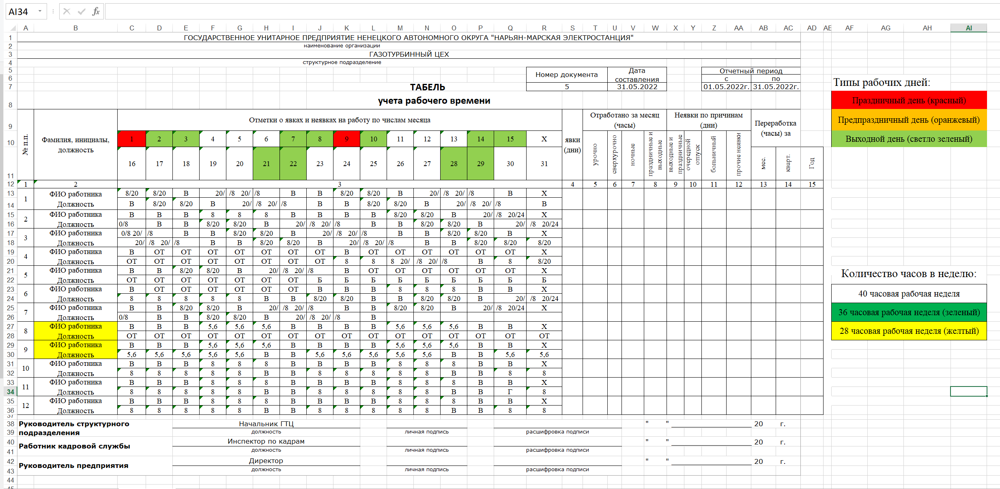

# Программа учета времени

Программа для автоматического заполнения 
табеля учета рабочего времени 
ГУП НАО "Нарьян-Марская электростанция"

# Результат работы программы

Программа заполняет поля: 
* "явки" (дни), 
* "урочно"(часы), 
* "ночные" (часы), 
* "праздничные и выходные" (часы), 
* "выходные и праздничные" (дни), 
* "очередной отпуск" (дни), 
* "больничный" (дни), 
* "прочие неявки" (дни),  
* "переработка" (часы).

на основе заполненных данных о работе человека в течение месяца

# Использование

Предзаполните ячейки с количеством рабочих часов 
Укажите цветом:
* выходные дни(светло зеленый), 
* праздничные дни (красный), 
* короткие предпраздничные дни (-1 час, оранжевый).
____
В зависимости от длительности рабочей недели работника
залить ячейку с именем работника цветом:

* 28 часовя рабочая неделя - желтый 
* 36 часовая рабочая неделя - зеленый 
* 40 часовая рабочая неделя - нет заливки
### Особые указания!
   **Для корректной работы программы 
   имя первого работника должно находиться в ячейке "В13"**

Не считает переработку при работе выходе на работу по приказу
____
Пример
